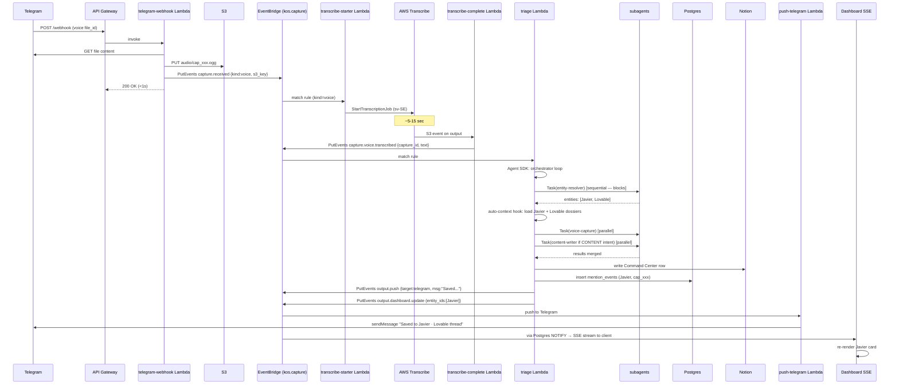
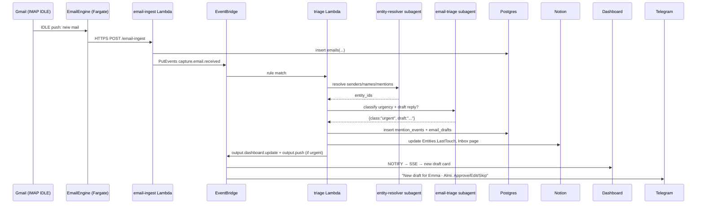
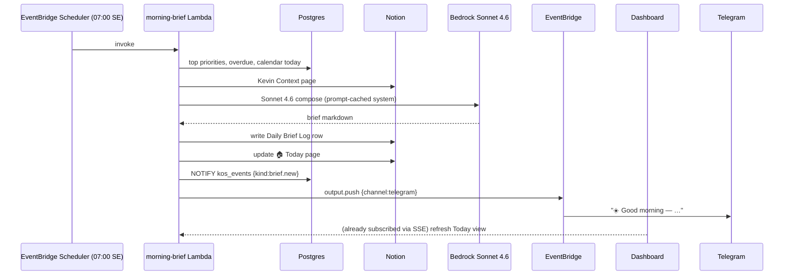
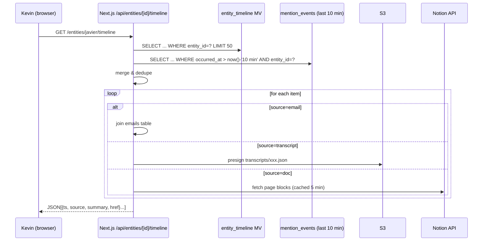
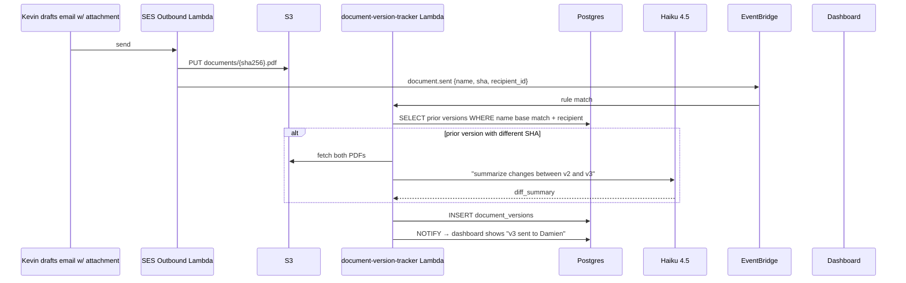
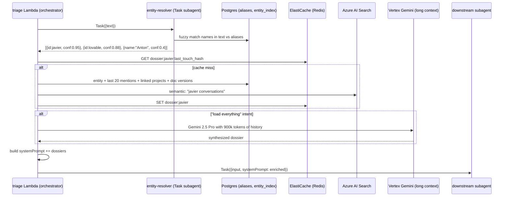
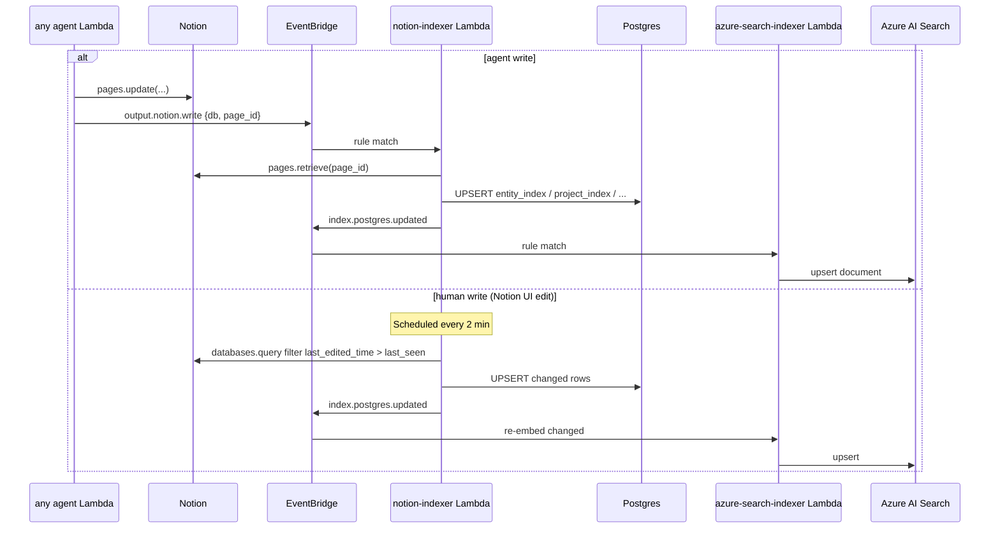

# Architecture Research — Kevin OS (KOS)

**Domain:** Single-user, event-driven personal AI OS (entity-centric)
**Researched:** 2026-04-21
**Confidence:** HIGH on component boundaries and data flow; MEDIUM on exact Lambda-vs-StepFunctions cutpoints; MEDIUM on AppSync-vs-SSE final choice (both viable)

---

## 0. Design Tenets (drive every decision below)

1. **Notion = source of truth for human-inspectable state.** Postgres = derived index + ops log. S3 = blobs. Azure AI Search = semantic cache. Single direction: Postgres rebuildable from Notion + S3.
2. **EventBridge = the nervous system.** Every capture becomes a typed event on the `kos.capture` bus. Every downstream action is a rule-matched subscriber. Captures never call agents directly — they publish.
3. **Claude Agent SDK = the orchestrator runtime.** Triage agent is an orchestrator with `Task`-spawned subagents. Not LangGraph. Not Step Functions for agent logic (Step Functions only for infra choreography).
4. **Single-user = no tenancy, no RLS, one IAM role.** This is load-bearing; it saves weeks.
5. **Lambda for events, Fargate for long-lived listeners, Step Functions only for >15min or high-durability flows.** Default to Lambda until a timeout forces otherwise.
6. **EU-first data residency, US-east only for Bedrock inference.** LLM calls don't persist data; everything at rest stays in eu-north-1 / West Europe.

---

## 1. System Overview

```
┌───────────────────────────────────────────────────────────────────────────────┐
│                              CAPTURE LAYER (push)                              │
│  Telegram Bot  │ iOS Shortcut │ Chrome Ext │ Email Fwd │ EmailEngine │ Baileys│
│   (Lambda)     │   (Lambda)   │  (Lambda)  │ (SES+Lmb) │  (Fargate)  │(Fargate)│
│                                                                                │
│                              CAPTURE LAYER (poll)                              │
│   Granola Poller (EventBridge Sched → Lambda) │ Discord Poller (Lambda)       │
└────────────────────────────────┬──────────────────────────────────────────────┘
                                 │  PutEvents → kos.capture bus
                                 ▼
┌───────────────────────────────────────────────────────────────────────────────┐
│                        EVENT LAYER — Amazon EventBridge                        │
│   Buses: kos.capture │ kos.triage │ kos.agent │ kos.output │ kos.system       │
│   Rules route by source + detail-type to Lambda targets                        │
└────────────────────────────────┬──────────────────────────────────────────────┘
                                 │
                                 ▼
┌───────────────────────────────────────────────────────────────────────────────┐
│                     AGENT LAYER — Claude Agent SDK on Lambda                   │
│                                                                                │
│   ┌─────────────┐     ┌─────────────────────────────────────────────────┐    │
│   │   Triage    │────▶│  Subagents (parallel via Task tool)             │    │
│   │ (Haiku 4.5) │     │  voice-capture │ entity-resolver │ email-triage │    │
│   │ orchestrator│     │  transcript-extract │ content-writer │ publisher │    │
│   └─────────────┘     └─────────────────────────────────────────────────┘    │
│          │                                                                     │
│          ▼ auto-context hook (pre-call): inject entity dossiers                │
│   ┌─────────────────────────────────────────────────────────────────┐         │
│   │  Tools: Notion MCP │ Postgres MCP │ Azure AI Search │ S3 │ SES  │         │
│   └─────────────────────────────────────────────────────────────────┘         │
└────────────────────────────────┬──────────────────────────────────────────────┘
                                 │
                                 ▼
┌───────────────────────────────────────────────────────────────────────────────┐
│                              MEMORY LAYER                                      │
│                                                                                │
│   Notion (SoT)    │  RDS Postgres (index + log)  │  S3 (blobs)                │
│   ─────────────      ─────────────────────────      ──────────                │
│   Entities DB       entity_index                   audio/                      │
│   Projects DB       aliases                        documents/                  │
│   Command Center    mention_events                 transcripts/                │
│   Transkripten      document_versions              attachments/                │
│   Kevin Context     agent_runs                                                 │
│   Daily Brief Log   event_log                                                  │
│                                                                                │
│   Azure AI Search   │   Vertex AI (Gemini 2.5 Pro)                             │
│   ───────────────       ─────────────────────────                              │
│   hybrid index          long-context dossier calls (1M tok)                    │
│   per doc + chunk                                                              │
└────────────────────────────────┬──────────────────────────────────────────────┘
                                 │
                                 ▼
┌───────────────────────────────────────────────────────────────────────────────┐
│                              OUTPUT LAYER                                      │
│                                                                                │
│   Next.js Dashboard (Vercel)   │  Telegram Push   │  Web Push  │  Notion      │
│   ├── REST/GraphQL to Postgres │  (Lambda → Bot)  │  (Lambda)  │  🏠 Today    │
│   └── SSE stream for updates   │                  │            │  page write  │
└───────────────────────────────────────────────────────────────────────────────┘
```

---

## 2. Component Boundaries & IPC Contracts

### 2.1 Capture Components

| Component | Runtime | IPC In | IPC Out | Why this runtime |
|-----------|---------|--------|---------|------------------|
| Telegram bot webhook | Lambda (API GW HTTP) | HTTPS POST from Telegram | PutEvents `kos.capture` + S3 put (audio) | Bursty, stateless, webhook |
| iOS Shortcut webhook | Lambda (API GW HTTP) | HTTPS POST (audio) | S3 put + PutEvents | Stateless, <30s |
| Chrome ext API | Lambda (API GW HTTP) | HTTPS POST (auth'd) | PutEvents | Stateless |
| Email forward | SES receipt rule → Lambda | SES event | S3 put (raw) + PutEvents | Native integration |
| EmailEngine | Fargate task (always-on) | IMAP IDLE push from Gmail | HTTPS POST → internal Lambda → PutEvents | **Long-lived IDLE socket, cannot be Lambda** |
| Baileys (WhatsApp) | Fargate task (always-on) | WebSocket to WA | HTTPS POST → internal Lambda → PutEvents | **Persistent WA socket, QR session state** |
| Granola poller | EventBridge Schedule → Lambda (every 15 min) | Schedule trigger | Notion API read → diff → PutEvents per new row | Poll, stateless |
| Discord poller | EventBridge Schedule → Lambda (every 5 min) | Schedule trigger | Discord API read → PutEvents | Fallback, low-frequency |

**IPC contract — every capture produces this event:**

```json
{
  "Source": "kos.capture",
  "DetailType": "capture.received",
  "Detail": {
    "capture_id": "cap_01HXXXX...",       // ULID
    "channel": "telegram" | "email" | "whatsapp" | "granola" | "shortcut" | "chrome" | "discord",
    "kind": "text" | "voice" | "email" | "transcript" | "highlight",
    "received_at": "2026-04-21T07:14:22Z",
    "raw_ref": { "s3_bucket": "...", "s3_key": "..." } | null,
    "text": "..." | null,
    "sender": { "id": "...", "display": "..." } | null,
    "metadata": { ... channel-specific ... }
  }
}
```

**Contract rules:**
- Captures are write-once. S3 object is immutable.
- Capture Lambdas MUST NOT call agents directly — only publish.
- If capture is voice, capture Lambda does NOT transcribe; it publishes `capture.received` with `kind: "voice"` and a separate `transcribe.requested` rule invokes Transcribe.

### 2.2 Event Layer — EventBridge

Five custom buses to prevent rule pollution and make IAM simple:

| Bus | Purpose | Example sources / detail-types |
|-----|---------|-------------------------------|
| `kos.capture` | All inbound from external sources | `kos.capture` / `capture.received`, `capture.voice.transcribed` |
| `kos.triage` | Triage decisions fan out here | `kos.triage` / `triage.route`, `triage.needs_confirmation` |
| `kos.agent` | Subagent invocations + results | `kos.agent` / `agent.invoke`, `agent.completed`, `agent.failed` |
| `kos.output` | User-visible surfaces | `kos.output` / `output.push`, `output.notion.write`, `output.dashboard.update` |
| `kos.system` | Audit, cron, health | `kos.system` / `schedule.07:00`, `schedule.18:00`, `health.degraded` |

**Rule examples:**

```
Rule: capture-voice-to-transcribe
  Bus: kos.capture
  Pattern: { source: ["kos.capture"], detail-type: ["capture.received"], detail: { kind: ["voice"] }}
  Target: Lambda fn:transcribe-starter

Rule: any-capture-to-triage
  Bus: kos.capture
  Pattern: { source: ["kos.capture"], detail-type: ["capture.received", "capture.voice.transcribed"] }
  Target: Lambda fn:triage-agent
```

### 2.3 Agent Layer

**Runtime model:** Triage is a Lambda invoked by EventBridge. Inside the Lambda, Claude Agent SDK runs the orchestrator with subagents defined in `.agents/*.md`. Subagents use the SDK's `Task` tool for parallel spawning.

**Why Lambda (not Step Functions) for agent logic:**
- Claude Agent SDK's orchestrator model expects a single process holding orchestrator context. Splitting across Step Functions states would require serializing conversation state between every subagent call.
- Lambda max 15 min is enough for 99% of agent turns (typical orchestrated turn: 10-60 sec). For the 1% that exceed it (bulk entity import), use **Step Functions Standard** to chunk the work, with each state invoking a fresh Lambda-hosted agent.
- 2025's "Lambda durable functions" can extend this, but keep it simple: Lambda for normal, Step Functions for exceptional.

**Fanout pattern (answering question 2):**

```
Triage Lambda receives event:
  1. Classify: what kind of capture? (voice, email, transcript, highlight)
  2. Extract entities via entity-resolver subagent (ALWAYS — sequential first, because downstream needs entities)
  3. Decide subagent set based on classification + entities
  4. PARALLEL-fan via Task tool to N subagents (max 5 in practice):
       - voice-capture + content-writer + publisher → 3-way fanout
       - email-triage + entity-resolver → sequential (resolver already ran) → just email-triage
  5. Collect results (SDK awaits all Task promises)
  6. Emit agent.completed event with merged result
```

**When parallel vs sequential:**
- **Sequential** when B needs A's output: entity-resolver → email-triage (needs entity IDs).
- **Parallel** when independent: voice-capture (Notion row write) + entity-resolver (extract mentions) — these can race because they write to different tables.

**Timeout protection:**
- Triage Lambda timeout: 60 sec. Any subagent fanout that risks >45 sec is offloaded: triage emits `agent.invoke` to `kos.agent` bus, a separate Lambda runs that subagent, emits `agent.completed`.
- Pattern: **"thin triage, fat specialists"** — triage decides, emits, exits.
- For genuinely long work (content-writer drafting 5 platform variants), use Step Functions Standard orchestrated by triage.

### 2.4 Memory Layer

| Store | Role | What lives there | Sync direction |
|-------|------|------------------|----------------|
| **Notion** | SoT for human-facing entities | Entities DB, Projects DB, Command Center, Transkripten, Daily Brief Log, Kevin Context | Writes from agents; humans also edit |
| **RDS Postgres (eu-north-1)** | Derived index + ops log | `entity_index`, `aliases`, `mention_events`, `document_versions`, `agent_runs`, `event_log`, `chat_history` | One-way: Notion → Postgres via CDC Lambda. Postgres is rebuildable. |
| **S3 (eu-north-1)** | Blobs | audio/, documents/, transcripts/, attachments/, notion-backups/ | Write-once. Lifecycle to Glacier at 90d. |
| **Azure AI Search (West Europe)** | Semantic retrieval | Chunked transcripts, emails, daily briefs, chat turns | One-way: after Notion/Postgres write → index Lambda pushes to Azure |
| **Vertex AI Gemini 2.5 Pro** | Long-context inference only | N/A (stateless) | Request/response only |

**Notion → Postgres sync mechanism:**
- Every agent write to Notion emits `output.notion.write` event with `{db_id, page_id, fields}`.
- A `notion-indexer` Lambda subscribes, fetches the page, upserts into the corresponding Postgres table.
- For human-originated Notion edits, a separate poller (every 2 min) lists `Entities` and `Projects` pages modified since last_seen and re-indexes. Notion has no webhook for DB-row changes at useful granularity, so poll.
- **Eventual consistency window: ~2 min for human edits, ~5 sec for agent edits.** Acceptable single-user.

### 2.5 Output Layer

| Surface | Runtime | Push mechanism |
|---------|---------|----------------|
| Next.js dashboard | Vercel | SSE endpoint streaming from Postgres LISTEN/NOTIFY (see §7) |
| Telegram push | Lambda (subscriber on `kos.output`) | Bot sendMessage |
| Web Push | Lambda (subscriber on `kos.output`) | VAPID to browser |
| Notion 🏠 Today | Lambda (subscriber on `kos.output`) | Notion API page update |

---

## 3. Recommended Project Structure

Monorepo (pnpm workspaces) — one repo, clear service boundaries.

```
kos/
├── apps/
│   ├── dashboard/              # Next.js 15 PWA (Vercel)
│   │   ├── app/
│   │   │   ├── (views)/today/ │ calendar/ │ inbox/
│   │   │   ├── entities/[id]/  # per-entity page with timeline
│   │   │   └── api/sse/        # SSE endpoint (Edge runtime)
│   │   └── lib/
│   │       ├── pg.ts           # Postgres client (read-side)
│   │       └── notion.ts       # read helpers
│   │
│   ├── emailengine/            # Fargate: Gmail IMAP IDLE
│   │   └── Dockerfile
│   └── baileys/                # Fargate: WhatsApp gateway
│       └── Dockerfile
│
├── services/                    # Lambda handlers
│   ├── capture/
│   │   ├── telegram-webhook/
│   │   ├── shortcut-webhook/
│   │   ├── chrome-webhook/
│   │   ├── email-receipt/
│   │   ├── granola-poller/
│   │   └── discord-poller/
│   ├── transcribe-starter/     # AWS Transcribe job kickoff
│   ├── transcribe-complete/    # on Transcribe done → publish
│   ├── triage/                 # the orchestrator Lambda
│   │   └── agents/             # .md subagent definitions loaded by SDK
│   │       ├── voice-capture.md
│   │       ├── entity-resolver.md
│   │       ├── email-triage.md
│   │       ├── transcript-extractor.md
│   │       ├── content-writer.md
│   │       └── publisher.md
│   ├── notion-indexer/         # Notion → Postgres CDC
│   ├── azure-search-indexer/   # Postgres write → Azure Search upsert
│   ├── push-telegram/
│   ├── push-web/
│   └── scheduled/
│       ├── morning-brief/       # 07:00
│       ├── email-triage-tick/   # every 2h
│       ├── day-close/           # 18:00
│       └── weekly-review/       # Sun 19:00
│
├── packages/
│   ├── contracts/              # shared TypeScript types for EventBridge events
│   │   └── events.ts
│   ├── agent-sdk-wrapper/      # Claude Agent SDK config + tool definitions
│   │   ├── tools/
│   │   │   ├── notion.ts
│   │   │   ├── postgres.ts
│   │   │   ├── search.ts
│   │   │   └── context-loader.ts  # auto-context hook
│   │   └── index.ts
│   ├── db/                     # Postgres schema + migrations
│   │   ├── migrations/
│   │   └── schema.ts
│   └── memory/                 # entity-graph + timeline reads
│       ├── entities.ts
│       ├── timeline.ts
│       └── dossier.ts
│
├── infra/                      # AWS CDK
│   ├── stacks/
│   │   ├── network.ts
│   │   ├── storage.ts          # RDS, S3, Secrets
│   │   ├── event-bus.ts
│   │   ├── capture.ts
│   │   ├── agents.ts
│   │   ├── output.ts
│   │   └── fargate.ts
│   └── cdk.json
│
└── .planning/                  # GSD system (this folder)
```

**Why this shape:**
- `services/` are individual deployable Lambdas — each has its own entry point, tight bundle.
- `packages/` are shared libraries consumed at build time — no runtime coupling.
- `contracts/` is the IPC spec — any Lambda producing or consuming events imports from here.
- `infra/` with CDK because multi-account capability later, typed infra, reusable constructs.

---

## 4. Answering the Specific Questions

### Q1. Telegram Voice Message — Exact Path



**Budget:** webhook ack <1s, transcribe 5-15s, triage 3-10s, user sees confirmation in ~10-25s total. Acceptable because webhook ack'd immediately; user doesn't wait.

### Q2. Fanout Patterns — Parallel vs Sequential

**Rule 1: Entity resolution is always first and sequential.** Every downstream agent benefits from resolved entities. Run it alone, then fan out.

**Rule 2: Fan in parallel when outputs are independent writes.** voice-capture writes to Notion Command Center; content-writer writes to Drafts table. These don't conflict.

**Rule 3: Fan sequentially when B reads A's output.** content-writer → publisher (publisher needs approved draft).

**Pattern in Agent SDK:**

```typescript
// Inside triage orchestrator
const entities = await Task({ subagent: 'entity-resolver', input: { text } });
await contextLoader.inject(entities);  // auto-context hook — §Q5

const classification = classify(text, entities);

const tasks = [];
if (classification.includes('voice-capture')) tasks.push(Task({ subagent: 'voice-capture', ... }));
if (classification.includes('content')) tasks.push(Task({ subagent: 'content-writer', ... }));
if (classification.includes('email-action')) tasks.push(Task({ subagent: 'email-triage', ... }));

const results = await Promise.all(tasks);  // parallel fanout
// Merge + emit output events
```

**Avoiding Lambda timeout:**
- Triage Lambda: 60s memory 512MB (orchestrator is light).
- Each subagent that might take >30s → **defer via event, don't await inline.** Triage emits `agent.invoke` with callback correlation ID; separate Lambda runs that subagent; emits `agent.completed` which triggers the merge/output step.
- Deferred pattern for content-writer + 5-platform drafting (can be 2-3 min): Step Functions Standard with parallel Map state, one branch per platform.

### Q3. Entity Graph Data Model

**Notion — source of truth:**

```
Entities DB (Notion)
├── Name                (title)
├── Aliases             (multi-select; "Javier", "Javi", "J. Soltero")
├── Type                (select: Person | Project | Company | Document)
├── Org                 (text)
├── Role                (text)
├── Relationship        (select: Investor | Partner | Advisor | Lead | Vendor | Team | Family | Other)
├── Status              (select: Active | Dormant | Closed | Watching)
├── LinkedProjects      (relation → Projects DB)
├── LinkedEntities      (relation → Entities DB, self-relation for "works with")
├── SeedContext         (text — short pitch of who/what)
├── LastTouch           (date, auto-updated by agent on every mention)
├── ManualNotes         (text, human-only)
└── PostgresID          (text, mirror of UUID for fast join)

Projects DB (Notion)
├── Name, Bolag, Status, Description, LinkedPeople, SeedContext, PostgresID
```

**Postgres — derived index + ops log:**

```sql
-- Entity index (mirror of Notion Entities)
CREATE TABLE entity_index (
  id UUID PRIMARY KEY,
  notion_page_id TEXT UNIQUE NOT NULL,
  name TEXT NOT NULL,
  type TEXT NOT NULL,            -- Person | Project | Company | Document
  org TEXT,
  role TEXT,
  relationship TEXT,
  status TEXT,
  seed_context TEXT,
  last_touch TIMESTAMPTZ,
  updated_at TIMESTAMPTZ NOT NULL DEFAULT now(),
  search_tsv TSVECTOR            -- full-text search index
);
CREATE INDEX ON entity_index USING GIN(search_tsv);
CREATE INDEX ON entity_index (type, status);

-- Aliases (normalized for fuzzy matching)
CREATE TABLE aliases (
  entity_id UUID REFERENCES entity_index(id) ON DELETE CASCADE,
  alias TEXT NOT NULL,
  alias_normalized TEXT NOT NULL,  -- lowercased, diacritics stripped
  source TEXT,                      -- manual | granola | gmail | onboarded
  PRIMARY KEY (entity_id, alias_normalized)
);
CREATE INDEX ON aliases (alias_normalized);

-- Every time an entity is mentioned anywhere — this is the timeline substrate
CREATE TABLE mention_events (
  id UUID PRIMARY KEY,
  entity_id UUID REFERENCES entity_index(id),
  source TEXT NOT NULL,             -- email | transcript | voice | chat | doc | task
  source_id TEXT NOT NULL,          -- capture_id, notion_page_id, or S3 key
  occurred_at TIMESTAMPTZ NOT NULL, -- when the mention happened (not indexed time)
  summary TEXT,                     -- 1-2 sentence LLM summary of the mention
  sentiment TEXT,                   -- positive | neutral | negative | decision | action
  search_tsv TSVECTOR,
  created_at TIMESTAMPTZ NOT NULL DEFAULT now()
);
CREATE INDEX ON mention_events (entity_id, occurred_at DESC);
CREATE INDEX ON mention_events USING GIN(search_tsv);

-- Projects mirror
CREATE TABLE project_index (
  id UUID PRIMARY KEY,
  notion_page_id TEXT UNIQUE,
  name TEXT,
  bolag TEXT,
  status TEXT,
  updated_at TIMESTAMPTZ
);

-- Entity ↔ Project many-to-many
CREATE TABLE entity_project (
  entity_id UUID REFERENCES entity_index(id),
  project_id UUID REFERENCES project_index(id),
  PRIMARY KEY (entity_id, project_id)
);

-- Document versions (Q6)
CREATE TABLE document_versions (
  id UUID PRIMARY KEY,
  document_name TEXT NOT NULL,
  sha256 TEXT NOT NULL,
  s3_key TEXT NOT NULL,
  recipient_entity_id UUID REFERENCES entity_index(id),
  sent_at TIMESTAMPTZ NOT NULL,
  sent_via TEXT,                   -- email | whatsapp | notion-share
  prior_version_id UUID REFERENCES document_versions(id),
  diff_summary TEXT,                -- LLM-generated diff in plain language
  UNIQUE (document_name, sha256, recipient_entity_id)
);
CREATE INDEX ON document_versions (document_name, sent_at DESC);

-- Agent run log
CREATE TABLE agent_runs (
  id UUID PRIMARY KEY,
  capture_id TEXT,
  agent_name TEXT,
  parent_run_id UUID REFERENCES agent_runs(id),
  status TEXT,                     -- started | completed | failed
  input_tokens INT,
  output_tokens INT,
  cost_usd NUMERIC(10,6),
  started_at TIMESTAMPTZ,
  completed_at TIMESTAMPTZ,
  result JSONB
);

-- Event log (debug)
CREATE TABLE event_log (
  id BIGSERIAL PRIMARY KEY,
  bus TEXT,
  source TEXT,
  detail_type TEXT,
  detail JSONB,
  occurred_at TIMESTAMPTZ DEFAULT now()
);
CREATE INDEX ON event_log (occurred_at DESC);
```

**Sync mechanism (Notion ⇄ Postgres):**
- **Agent writes:** Agent writes Notion first, then emits `output.notion.write` event. `notion-indexer` Lambda upserts Postgres.
- **Human writes (Kevin edits Notion by hand):** Poll every 2 min with `filter: last_edited_time > last_seen`. Upsert changed rows.
- **Postgres is read-side for the dashboard.** Never write directly to Postgres except via the indexers.
- **If Postgres gets corrupt:** rebuild from Notion + S3 by replaying the indexers on all pages. This is a 1-hour job, not a migration plan, just a "rebuild" command.

### Q4. Per-Entity Timeline — Read Pattern

**Decision: hybrid — materialized-view-for-read-speed, query-time-for-freshness.**

**The view:**
```sql
CREATE MATERIALIZED VIEW entity_timeline AS
SELECT
  m.entity_id,
  m.occurred_at,
  m.source,
  m.source_id,
  m.summary,
  m.sentiment,
  e.name AS entity_name
FROM mention_events m
JOIN entity_index e ON e.id = m.entity_id
ORDER BY m.entity_id, m.occurred_at DESC;

CREATE UNIQUE INDEX ON entity_timeline (entity_id, occurred_at, source_id);
```

**Refresh strategy:**
- `REFRESH MATERIALIZED VIEW CONCURRENTLY entity_timeline` on a 5-min EventBridge schedule.
- For Kevin's "hot" entities (last 5 viewed), the dashboard also does a live query against `mention_events` filtered to `occurred_at > NOW() - INTERVAL '10 minutes'` and unions with MV. This way, a mention from 2 min ago appears instantly even if MV is stale.

**Attachment fetch:**
- Timeline row `source_id` resolves to either a Notion page, S3 object, or another Postgres row.
- Dashboard calls a single `GET /api/entities/{id}/timeline?limit=50&cursor=...` endpoint which:
  1. Reads from `entity_timeline` MV + live overlay.
  2. For each row, resolves the source: if Notion, fetches the block; if S3, generates a presigned URL; if email, fetches Postgres `emails` table.
  3. Returns enriched rows.
- With pg_stat_statements + index on `(entity_id, occurred_at DESC)` this is <50ms for 50 rows even at 100k mentions.

**Why not query-time-only:** 7 channels × months of data = joins across mention_events + emails + transcripts + documents + tasks. Single query would be 200-500ms. MV precomputes.

**Why not fully precomputed (e.g., per-entity JSON doc):** stale reads would surprise Kevin within minutes of a conversation. Hybrid is the sweet spot.

### Q5. Auto-Context Loading

**Mechanism: pre-call hook that registers as a tool + system prompt injector in the Claude Agent SDK.**

The SDK supports two mechanisms that work together:

1. **`systemPrompt` builder (per-call):** The orchestrator's system prompt is built dynamically per invocation. Before calling any subagent, the orchestrator runs:
   ```
   entities = entity-resolver(text)
   dossiers = load_dossiers(entities)
   subagent.systemPrompt = baseSystemPrompt + "\n\n<entity_context>\n" + dossiers + "\n</entity_context>"
   ```

2. **`load_dossier` tool always available:** Even inside a subagent mid-run, if it encounters a new entity name, it can call `load_dossier(entity_name)` to pull the dossier on-demand. This is Notion's "bring your own context" pattern.

**Dossier assembly (the `load_dossier` tool):**
```
INPUT: entity name or ID
FETCH:
  1. entity_index row from Postgres
  2. Last 20 mention_events
  3. Linked projects
  4. Latest document_versions (last 5)
  5. For Tier-1 entities (Damien, Christina, etc.): Azure AI Search top-10 semantic chunks
  6. For "load-everything" context: Vertex Gemini 2.5 Pro call with full transcript history
RETURN: markdown-formatted dossier, ~2-5k tokens typical
```

**Caching:**
- Dossier for each entity cached in Redis (ElastiCache) keyed by `entity_id + last_touch`. Invalidated on `mention_events` insert.
- Prompt-caching at Anthropic: the base system prompt (Kevin Context) uses `cache_control: ephemeral` so it's cheap to re-send per call.

### Q6. Document Version Tracking

Schema in §Q3 (`document_versions`).

**Trigger chain:**
1. Kevin attaches a doc to an email (outbound via SES) OR receives one in WhatsApp/email inbound.
2. Capture Lambda on outbound: SES sending flow hashes each attachment (`sha256`), uploads to `s3://kos-documents/{sha}`, emits `document.sent` event.
3. `document-version-tracker` Lambda:
   - Extracts `document_name` (filename + fuzzy base: "Tale Forge AB Avtal v3.pdf" → base `"Tale Forge AB Avtal"`).
   - Looks up prior version with same base sent to the same recipient.
   - If found with different SHA → generates diff summary via Haiku: "v3 adds clause 4.2 about ESOP vesting, removes prior section on board seats."
   - Inserts row with `prior_version_id`.
4. On inbound (receiving a doc back): same flow, `sent_via` = `email-inbound` or equivalent.

**Why SHA-based:** deterministic, dedupes identical re-sends, survives renames.

### Q7. Real-Time Dashboard Updates

**Decision: SSE from Next.js route handler, backed by Postgres LISTEN/NOTIFY.**

**Why not AppSync Events:**
- AppSync is great for mobile + multi-user real-time with auth-per-channel. Single-user dashboard doesn't need any of that.
- Adds a whole service layer for no benefit at this scale.

**Why not Supabase Realtime:**
- Mixes cloud providers (we're AWS-primary); pulls Kevin into a new vendor relationship; RDS already has NOTIFY built in.

**Why not raw WebSockets:**
- One-way server→client is all the dashboard needs. SSE is simpler, auto-reconnects, works through every proxy, and is native to `ReadableStream` in Next.js 15 Edge runtime.

**Implementation:**
```
Lambda (e.g. morning-brief) writes row to Postgres.
Lambda executes `NOTIFY kos_events, '{"kind":"brief.new","date":"2026-04-22"}'`.

Next.js /api/sse route handler (Edge):
  - Opens a persistent Postgres connection on first client connect.
  - `LISTEN kos_events`.
  - On NOTIFY, writes `data: {json}\n\n` to the SSE stream.
  - Client has EventSource reconnecting with backoff.
```

**Connection lifetime concern:** Next.js on Vercel Edge has a 30s stream max on Hobby / 300s on Pro. Client reconnects seamlessly. For longer sessions, self-host the SSE endpoint on a small Fargate `next-start` or use `fluid compute`.

### Q8. Cross-Region / Cross-Cloud Latency Budget

**Regions:**
- RDS, S3, EventBridge, Lambda: **eu-north-1** (Stockholm — GDPR + low latency to Kevin)
- Bedrock: **us-east-1** (Sonnet 4.6, Haiku 4.5 not fully in eu-north-1 in 2026 — verify when provisioning)
- AWS Transcribe: **eu-north-1** if Swedish is supported; otherwise eu-west-1 (Ireland)
- Azure AI Search: **West Europe** (Amsterdam) — same continent, ~20ms from eu-north-1
- Vertex AI Gemini: **europe-west4** (Eemshaven, NL) for data residency

**Latencies (measured expectations):**

| Hop | Latency | Notes |
|-----|---------|-------|
| Lambda (eu-north-1) → Bedrock (us-east-1) | ~95-110ms RTT | Plus model inference (Haiku ~400ms, Sonnet ~2-5s) |
| Lambda → RDS (same region) | <2ms | Inside VPC |
| Lambda → Notion API | ~80-150ms | Cloudflare-fronted |
| Lambda → Azure AI Search (eu-north-1 → West Europe) | ~25-40ms | Public internet |
| Lambda → Vertex AI (eu-north-1 → europe-west4) | ~20-30ms |  |
| Lambda → S3 (same region) | <10ms |  |

**Budget for "Kevin sends voice message → confirmation in Telegram":**
- Webhook ack: <1s (MUST be fast, Telegram retries)
- Transcribe: 5-15s (bulk of wait)
- Triage Haiku call: ~600ms-1.5s (us-east-1 inference is the ceiling)
- Subagent Haiku calls × 2-3 parallel: ~2s total (parallelism wins)
- Notion write: ~300ms
- Telegram send: ~200ms
- **Total: 8-20s end-to-end** — acceptable.

**Where cross-region hurts:**
- **Don't** chain 5 Bedrock calls in series without parallelizing. 5 × 110ms RTT = 550ms of pure network before tokens flow.
- **Do** prompt-cache everything static (Kevin Context) — eliminates 80% of repeated cross-region prefill.
- **Do** keep Azure Search calls off the hot path; only the orchestrator calls it, not every subagent.

**When cross-cloud becomes painful:**
- If Vertex Gemini 1M-context call becomes routine (>10/day), the 30s call itself eats budget; throw it behind an event-driven flow ("loading full dossier..." → later push with result).

### Q9. Failure Modes

| Failure | What breaks first | Detection | Fallback |
|---------|-------------------|-----------|----------|
| **Notion API rate limit** (3 req/s) | Bulk indexer or startup backfills | 429 response | SQS FIFO queue in front of `notion-indexer`, per-second rate limiter; retry with backoff |
| **Notion outage** | All writes to SoT | Healthcheck Lambda every 5min | Buffer writes to SQS; replay on recovery. Reads serve from Postgres (last known good) — dashboard stays working |
| **Gmail OAuth token expired** | EmailEngine stops delivering | IMAP auth failure log → CloudWatch alarm → Telegram DM to Kevin | Manual re-auth flow on dashboard `/settings/gmail`; EmailEngine reloads from Secrets Manager on next loop |
| **WhatsApp QR session terminated** | Baileys disconnects | Baileys emits "loggedOut"; Fargate task sends Telegram DM with new QR | Kevin rescans from phone; new QR in Telegram DM |
| **Bedrock degraded / us-east-1 outage** | All agent runs | Retry with exponential backoff; on third 5xx → CloudWatch alarm | **Fallback chain: Bedrock us-east-1 → Bedrock us-west-2 → Anthropic API (keyed separately) → Vertex Gemini.** Set via environment map; triage Lambda reads `LLM_PROVIDER_CHAIN` |
| **AWS Transcribe degraded** | Voice captures queue up | Transcribe job 503/timeout | Fall to self-hosted KB-Whisper on Fargate (INF-spec) |
| **RDS failover** | Reads + writes briefly 503 | Multi-AZ auto-failover ~60s | Lambdas retry; SSE reconnects |
| **Azure AI Search outage** | Semantic search returns no hits | Index calls fail | Degrade gracefully to Postgres `tsvector` full-text (same bag of docs indexed in parallel) |
| **Vertex Gemini quota** | Long-context dossier calls fail | 429 | Fallback to Sonnet 4.6 with truncated dossier (top-20 mention_events only) |
| **Next.js (Vercel) down** | Dashboard unreachable | Synthetic monitor | Telegram remains fully functional — primary capture + output path unaffected |

**The one failure that's bad:** EventBridge bus itself going down. Historically ~99.99%, and it's the pivot. Mitigation: mission-critical captures (Telegram, Shortcut) write directly to SQS as a belt-and-suspenders fallback queue that a recovery job replays.

### Q10. Bootstrapping Order — Dependency DAG

```
                          ┌──────────────────┐
                          │ AWS account +    │
                          │ CDK baseline     │
                          │ (VPC, IAM, S3)   │
                          └────────┬─────────┘
                                   │
                    ┌──────────────┼──────────────┐
                    ▼              ▼              ▼
            ┌───────────┐  ┌────────────┐  ┌─────────────┐
            │ RDS       │  │ EventBridge│  │ Secrets Mgr │
            │ Postgres  │  │ buses      │  │ (API keys)  │
            │ + schema  │  └────┬───────┘  └─────────────┘
            └─────┬─────┘       │
                  │             │
                  ▼             ▼
            ┌────────────────────────────────┐
            │ Entity graph (Notion DBs +     │  ◀── FOUNDATION
            │ Postgres index + notion-indexer│
            │ Lambda + initial sync)         │
            └─────┬──────────────────────────┘
                  │
         ┌────────┼────────┐
         ▼        ▼        ▼
   ┌──────────┐ ┌───────────────┐ ┌──────────────┐
   │ Agent    │ │ Capture:      │ │ Capture:     │
   │ SDK base │ │ Telegram bot  │ │ email-forward│
   │ + triage │ │ (primary)     │ │ via SES      │
   │ + entity │ └───────┬───────┘ └──────┬───────┘
   │ resolver │         │                │
   └─────┬────┘         │                │
         │              │                │
         └──────┬───────┴────────────────┘
                ▼
         ┌───────────────────────────────┐
         │ E2E smoke: Telegram voice →   │ ◀── MILESTONE: talks to self
         │ Transcribe → triage → entity  │
         │ → Notion write → Telegram ack │
         └──────┬────────────────────────┘
                │
         ┌──────┼──────────────┬─────────────┐
         ▼      ▼              ▼             ▼
   ┌─────────┐ ┌────────┐ ┌────────────┐ ┌───────────┐
   │ voice-  │ │ iOS    │ │ EmailEngine│ │ Granola   │
   │ capture │ │ Shortct│ │ (Fargate)  │ │ poller    │
   │ agent   │ └────────┘ │ + email-   │ │ + transcr-│
   └─────────┘            │ triage agt │ │ extractor │
                          └────────────┘ └───────────┘
                │
                ▼
         ┌─────────────────────────┐
         │ Dashboard v1 (Today +   │
         │ per-entity timeline)    │ ◀── MILESTONE: dashboard MVP
         └──────┬──────────────────┘
                │
         ┌──────┼──────────┐
         ▼      ▼          ▼
   ┌─────────┐ ┌────────┐ ┌───────────┐
   │ Chrome  │ │ Baileys│ │ Azure AI  │
   │ ext     │ │ WApp   │ │ Search +  │
   │(LI+high)│ │(Fargate│ │ indexer   │
   └─────────┘ └────────┘ └───────────┘
                │
                ▼
         ┌─────────────────────────┐
         │ Lifecycle automation:   │
         │ morning/day-close/weekly│
         └──────┬──────────────────┘
                │
                ▼
         ┌─────────────────────────┐
         │ Content-writer agent,   │
         │ publisher, Postiz       │
         └──────┬──────────────────┘
                │
                ▼
         ┌─────────────────────────┐
         │ V2 specialists:         │
         │ competitor, market,     │
         │ investor, legal         │
         └─────────────────────────┘
```

**Critical insight:** the entity graph is **first and blocking**. Every agent assumes resolved entities. No agent above the line labeled FOUNDATION can be built meaningfully until ENT-01, ENT-02, and bulk import (ENT-05, ENT-06) have produced a useful corpus.

Second insight: **Telegram + triage + entity-resolver is the minimum valuable loop.** Everything else is additive. Build this as the first vertical slice end-to-end so you have a working KOS at the earliest possible moment.

### Q11. Single-User Simplicity Wins

Where to skip complexity:

| Normally | For KOS | Savings |
|----------|---------|---------|
| Row-level security in Postgres | One DB, one role, `GRANT ALL` | No RLS policies to write/test |
| Per-user auth on dashboard | Single hardcoded auth: Clerk free tier with 1 allowed email, or just a Vercel password | No signup, no roles |
| API Gateway authorizer per endpoint | One shared `KOS_WEBHOOK_SECRET` in Secrets Manager, validated in each Lambda | No Cognito, no JWT |
| Per-user Bedrock IAM | Single `KOSLambdaRole` with Bedrock invoke for all models | One IAM role |
| Multi-tenant data partitioning | `WHERE owner_id = :x` nowhere | Simpler SQL |
| Per-user rate limiting | Single global rate limits at SQS level | No token buckets |
| Feature flags per user | Env vars + deploy | No LaunchDarkly |
| Audit log for compliance | `event_log` table is enough; no SOC 2 | No separate audit sink |
| CI/CD with preview envs per PR | Single dev + prod; or just prod (single user, reversible writes) | Half the infra |
| Secrets rotation automation | Manual rotate once a year | No rotation Lambda |

**Pressed-to-the-max version:** start with **one** AWS account, **one** IAM role, **one** RDS instance (t4g.small), **one** VPC, **one** SSE endpoint, no CDN custom domain. You can harden later; single-user means the blast radius is yourself.

---

## 5. Data Flow Diagrams (the 7 most important)

### 5.1 Voice capture (answered in §Q1 — see Mermaid diagram above)

### 5.2 Email inbound → triage → draft



### 5.3 Morning brief at 07:00



### 5.4 Entity timeline read



### 5.5 Document version diff



### 5.6 Entity resolution + auto-context injection



### 5.7 Notion ⇄ Postgres sync



---

## 6. Runtime Placement Matrix

| Concern | Runtime | Why |
|---------|---------|-----|
| Webhooks (Telegram, Shortcut, Chrome ext) | Lambda (API GW HTTP) | Bursty, stateless, <30s |
| Scheduled polls (Granola, Discord) | Lambda (EventBridge Scheduler) | <15 min, stateless |
| Long-lived IMAP IDLE | Fargate | Persistent TCP socket |
| WhatsApp Baileys session | Fargate | Persistent WS + QR state |
| Triage orchestrator | Lambda (60s, 512MB) | Thin, event-triggered |
| Subagent runs | Lambda (usually 60-120s, 1GB) | Event-triggered |
| Long-context dossier loads | Lambda (up to 15 min) | One-shot Gemini call |
| Bulk content drafting (5-platform) | **Step Functions Standard** with Map parallel | Exceeds Lambda 15min; want visual debug |
| SSE endpoint | Next.js Edge on Vercel | Native stream, auto-scaling |
| Dashboard reads | Next.js Route Handlers on Vercel | Standard HTTP |
| Event router | EventBridge | Built for this |
| Durable async | SQS FIFO (for Notion API rate protection) | DLQ + ordering |
| Secrets (OAuth tokens, API keys) | AWS Secrets Manager | Rotation-ready |
| Audio blobs | S3 eu-north-1 | Cheap, durable |
| Document blobs | S3 eu-north-1 | Same |
| Entity graph SoT | **Notion** | Human inspect + edit |
| Entity graph index | **Postgres RDS** | Fast queries |
| Semantic search | **Azure AI Search** | Best hybrid ranker, uses credits |
| Time-series / logs | Postgres `event_log` + CloudWatch | Single-user scale |
| Long-context inference | **Vertex Gemini 2.5 Pro** | 1M tokens |
| Daily inference | **Bedrock Sonnet 4.6 / Haiku 4.5** | Credits + low latency to us-east-1 |

---

## 7. Build Order — Suggested Phase Structure for the Roadmap

Downstream consumer wanted this explicit. The phase boundaries fall naturally:

1. **Phase 1 — Foundation (no users impact)**: CDK baseline, RDS, S3, EventBridge, Secrets, VPC. Notion Entities + Projects DBs. Postgres schema. `notion-indexer` Lambda. Kevin Context page seeded.
2. **Phase 2 — Minimum Viable Loop**: Telegram webhook + Transcribe + triage + entity-resolver + voice-capture agent + Notion writes + Telegram push. End-to-end voice-in, confirmation-out. *This is the moment KOS exists.*
3. **Phase 3 — Dashboard MVP**: Next.js app, /today + /entities/[id] with timeline MV, SSE. Auth (simple). Mobile PWA install.
4. **Phase 4 — Inbound channels expansion**: iOS Shortcut, email-forward (SES), EmailEngine + email-triage agent, Chrome highlight extension.
5. **Phase 5 — Messaging channels**: Chrome LinkedIn extension, Baileys WhatsApp, Discord fallback confirmed.
6. **Phase 6 — Granola + semantic memory**: Granola poller + transcript-extractor, Azure AI Search + indexer, dossier cache.
7. **Phase 7 — Lifecycle automation**: Morning brief, day close, weekly review, email triage tick.
8. **Phase 8 — Outbound content**: Content-writer, publisher, Postiz wiring, draft approval flow.
9. **Phase 9 — V2 specialists**: Competitor-watch, market-analyst, investor-relations, legal-flag. Only after Phase 2-8 are boring and stable.
10. **Phase 10 — Migration & decommission**: Absorb classify_and_save / morning_briefing / evening_checkin from VPS; decommission n8n + Hetzner; archive 5 Brain DBs.

**Dependencies at a glance:**
- Phase 2 depends on Phase 1 entirely.
- Phases 3 and 4 can run in parallel after Phase 2.
- Phase 6 unlocks quality on every preceding agent.
- Phase 8 can precede Phase 7 if Kevin wants content sooner than routines.

---

## 8. Patterns to Follow

### Pattern 1: "Thin triage, fat specialists"

**What:** triage Lambda stays <60s, decides and emits; specialists do the actual work in their own Lambdas/steps.
**When:** always, for the orchestrator Lambda.
**Trade-off:** extra event hop (latency ~100ms), won in reliability + timeout safety.

### Pattern 2: "Write Notion first, index Postgres second"

**What:** always write Notion as SoT, then async update Postgres via indexer. Never write Postgres first.
**Why:** Postgres is rebuildable from Notion; the reverse isn't true. If agent fails mid-write, there's no inconsistency to reconcile.

### Pattern 3: "Prompt-cache the world"

**What:** Kevin Context, base system prompts, recent entity dossiers all sent with `cache_control: ephemeral`.
**Why:** crosses cross-region hop cheaply; Bedrock Sonnet 4.6 supports it; 80%+ of repeated tokens become free after first call.

### Pattern 4: "Correlation ID on every event"

**What:** `capture_id` (ULID) generated at capture; flows through every event Detail, every agent_runs row, every Notion property.
**Why:** single-user debugging: "what happened with the 3pm voice memo" → trace across every service.

### Pattern 5: "Idempotent upserts, never deletes"

**What:** every indexer / writer uses `UPSERT` keyed on (notion_page_id) or (sha256). No delete-then-insert.
**Why:** retries are safe; partial failures don't corrupt state.

---

## 9. Anti-Patterns to Avoid

### Anti-Pattern 1: Captures calling agents directly

**What:** Telegram webhook calling Bedrock in the same Lambda.
**Why bad:** breaks the event contract, couples transports, webhook times out if Bedrock does.
**Instead:** webhook PutEvents → rule → triage Lambda.

### Anti-Pattern 2: Using Postgres as SoT because it's "faster"

**What:** agents write Postgres; Notion is "exported" nightly.
**Why bad:** Kevin can't edit Notion and have it stick. The human-in-the-loop loop dies. Postgres drift is invisible.
**Instead:** Notion SoT, Postgres derived.

### Anti-Pattern 3: Massive orchestrator system prompt

**What:** loading all entity dossiers, full Kevin Context, every style guide at the start of every call.
**Why bad:** cost (even cached), rate limits, confusion for weak model.
**Instead:** lazy dossier loading via `load_dossier` tool; static base only for always-relevant Kevin Context.

### Anti-Pattern 4: Step Functions for agent conversation state

**What:** putting each agent turn in a Step Functions state.
**Why bad:** serializing SDK session state between steps is painful; visual debugging wins are small; Claude Agent SDK's Task-based fanout is already the right abstraction.
**Instead:** Lambda-hosted Agent SDK for conversation; Step Functions only for infra orchestration (bulk import, long async jobs).

### Anti-Pattern 5: Multi-provider abstraction layer upfront

**What:** building a LiteLLM-style wrapper "in case we switch."
**Why bad:** YAGNI for single-user; lowest common denominator blocks Bedrock features (prompt caching, Sonnet-specific tooling).
**Instead:** direct Bedrock SDK calls; narrow fallback chain to Anthropic API + Vertex for outage case only.

### Anti-Pattern 6: Every capture gets routed through the same fat triage prompt

**What:** triage has to classify 12 capture kinds + 8 intents + choose from 10 subagents.
**Why bad:** Haiku 4.5 will degrade with that much decision surface.
**Instead:** capture channel pre-routes: Telegram kind=voice → already known to be voice-capture path; only the intent classifier runs. Channel metadata restricts the decision space.

---

## 10. Scalability Considerations (single-user, but volume matters)

| Concern | At realistic load (Kevin alone) | What to watch |
|---------|--------------------------------|----------------|
| Captures / day | 100-300 (email-heavy) | EventBridge: trivial. RDS: fine on t4g.small for years. |
| Agent runs / day | 50-150 | Bedrock cost: $3-10/day at Sonnet+Haiku mix. |
| Notion writes / hour | Peak 30, avg 5 | Rate limit 3/s per integration; SQS FIFO guards it. |
| S3 audio / month | ~1-2 GB | Glacier at 90d; $0.10-0.30/mo. |
| Azure Search docs | 10-50k chunks | Free tier (50MB) insufficient; Basic tier ~$75/mo on credits. |
| Postgres rows | mention_events grows ~50k/yr | t4g.small fine to 10M rows. Partition if >1yr. |

**The scale risk is semantic search index size**, not compute. Plan Azure Search Basic from day 1; partition by year if needed.

---

## 11. Sources (confidence levels)

- [AWS Lambda workflow & events](https://docs.aws.amazon.com/lambda/latest/dg/workflow-event-management.html) — HIGH
- [AWS Lambda durable functions (re:Invent 2025)](https://aws.amazon.com/blogs/aws/build-multi-step-applications-and-ai-workflows-with-aws-lambda-durable-functions/) — HIGH
- [AWS Prescriptive Guidance: agentic-ai-serverless orchestration models](https://docs.aws.amazon.com/prescriptive-guidance/latest/agentic-ai-serverless/orchestration-models.html) — HIGH
- [Claude Code sub-agents & orchestrator pattern](https://code.claude.com/docs/en/agent-teams) — HIGH
- [Claude Code split-and-merge (parallel fanout)](https://www.mindstudio.ai/blog/claude-code-split-and-merge-pattern-sub-agents) — MEDIUM
- [Multi-agent sessions — Claude API docs](https://platform.claude.com/docs/en/managed-agents/multi-agent) — HIGH
- [SSE in Next.js 15 for real-time dashboards](https://nextjslaunchpad.com/article/nextjs-server-sent-events-real-time-notifications-progress-tracking-live-dashboards) — MEDIUM
- [AppSync Events — serverless WebSockets](https://www.readysetcloud.io/blog/allen.helton/appsync-events/) — MEDIUM
- [EventBridge event-driven architecture patterns](https://docs.aws.amazon.com/lambda/latest/dg/concepts-event-driven-architectures.html) — HIGH
- Project context: `C:\Users\Jzine\Desktop\BrainOS\.planning\PROJECT.md` — HIGH

**What's LOW confidence and worth phase-level deeper research:**
- Exact Bedrock model availability in eu-north-1 by the time phases run (models shift region-by-region monthly).
- AWS Transcribe Swedish (sv-SE) regional availability.
- Claude Agent SDK's specific `cache_control` token limits in Bedrock vs Anthropic direct — verify per-phase.
- AppSync Events vs SSE final call: SSE picked for simplicity, but if Kevin later wants multi-device sync with presence, revisit.
